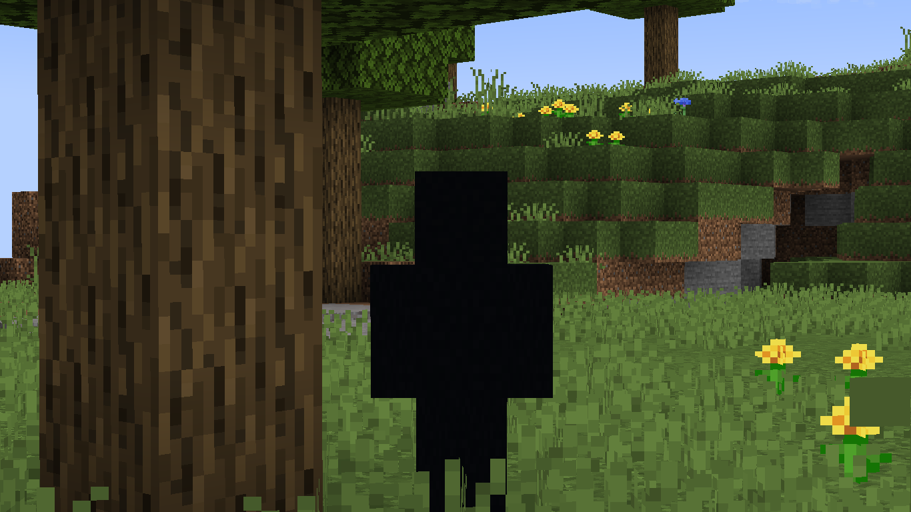
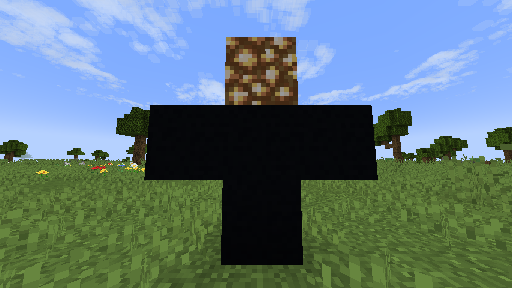

# Lumenfuchs' Dummypedia: How to Dummy

The datapack adds a singular entity: the Dummy. Relentless and nigh-unstoppable, knowing how it behaves is crucial for one's survival.

## The Dummy

The Dummy is a condensed mass of darkness, said to be from the depths of the Void. Some even go as far as to say it is an omen which seeks those who are abandoned by their gods.

By default, the Dummy does not spawn on its own (see [here](#dummynatural_spawning-default-true)). In order to be present in a world, the player must summon it by either of two methods:

* Running the command: `/function lumenfuchs:dummy/summon`
* Building a Dummy Totem, made with (almost) any black-dyed material placed in a T shape, with a Glowstone block at its top.

### Stats

The Dummy has 8 (4 hearts) health, and moves at a rate of roughly half a block per second. Despite looking solid, its highly volatile material damages anything it touches, dealing 2 (1 heart) thorns damage.

If present, players may hear knocking or something breaking in the distance.  
When targeted, a player may also hear the faint sound of wind unusually agitated. When those sounds become louder, the Dummy is near.

### Behaviors

The Dummy has a set of default behaviors whenever there are players within its detection range:

| Range (inclusive) | Behavior   |
| :---------------: | -------- |
| 512 blocks (32 chunks) | The Dummy *stalks* the nearest player, walking towards their position. It phases through blocks and climbs any wall, but will avoid holes and strongly powered redstone. |
| 128 blocks (8 chunks) | The Dummy *stares* the nearest player, facing its body towards its target. If stared back, it freezes. |
| 4 blocks | The Dummy raises its arm to perform its signature "attack", conjuring chaos unto the land. |

When no players are nearby, it simply stands in place, still as a statue.

## The Datapack

The datapack is a proof-of-concept at creating entities without basing it on an existing mob, or retexturing a mob with custom behavior.

The Dummy is composed of six `minecraft:item_display` entities (the "limbs" -- arms, legs, torso and head) and one `minecraft:interaction` (the hitbox).

All composing entities are assigned a Globally Unique Identifier (with the `dummy_lib.guid` objective) at spawn, which the `interaction` entity uses for moving the correct limbs around. A custom *move* function is implemented (as `dummy_lib:physics/move`), which teleports all limbs by their GUID to the target position, then realigns each one with the correct Y position. All other functions which target the limbs also use this GUID for ensuring the targeted limb belongs to that Dummy.

Some observations on working with a non-mob custom entity:

* The entity is inherently immune to status effects and enemy aggro. This can be both useful, as there is no weird/unwanted aggro (e.g. Zombies attacking Villagers, or mobs retaliating when attacked), but also imposes its own limitations; The Dummy cannot be made invisible, float or receive damage reduction with potion effects, for instance.
* The entity has no physics by default; The developer must create their own simulation. This has obvious pros and cons, as well as less-known side effects. The more accurate to vanilla you want to make your creation, the more complex it will be and the more resources will be used.
* The entity has no default behavior; If none is created by the developer, it is simply a lifeless shell. As with physics, complex behaviors take significantly more effort than with regular mobs, and often consume more resources. However, there are no unwanted behaviors to circumvent.
* Creating the desirable appearance is significantly harder, as the model must be created from scratch. If a custom texture is desired, it can also be significantly harder to add to the entity. On the other hand, this allows custom models and textures to be created without requiring a resource pack.

The task is complex, and takes a significantly higher amount of time in comparison to using an existing entity for a base. However, unmatched levels of customizability are achievable by this approach, with entities being as simple or as complex as the developer desires.

The Dummy is but a mere example. Many of its quirks are fitting to the character, but a decently-coded datapack could do much more with remarkable results. That is the goal with creating this datapack.

## Settings

The datapack provides settings for tweaking nearly all of the Dummy's behavior, divided in four categories. All settings are set at the first world load (i.e. when first opening/reloading the world with the datapack enabled), and are not restored if removed unless the `first_load` *flag* is removed.

> Flags are bits of data saved at storage `lumenfuchs:flags`, which tell the datapack how to operate. All settings are saved as flags in the same location.

All settings can be seen and edited on the datapack's **settings panel**, accessible by running the command `/trigger lumenfuchs:settings`

### Appearance

#### dummy.material (Default: `minecraft:black_concrete`)

This defines the `id` of the item used by the Dummy's `item_display` entities. Works best when set to a block, as it fully shows the Dummy's model. If set to `minecraft:air`, the Dummy is invisible.

Has several suffixed variants, each for a given part of the Dummy's body: `.head`, `.torso`, `left_arm`, `right_arm`, `.left_leg`, and `.right_leg`. The suffix `_all` (`dummy.material_all`) sets all previous variants to its value, similar to this setting's behavior prior to v1.3.0. The `_all` flag is always removed after being applied.

Some textures can look off here, as all limbs except the head will display a stretched texture instead of its original resolution.

#### dummy.material_hurt (Default: `minecraft:red_concrete`)

This defines the `id` of the item used by the Dummy's `item_display` entities when it is hit by a player. Works best as a red-tinted block, which simulates entities' red overlay when hurt. If set to the same as `dummy.material`, this effect is disabled.

As with the above, has several suffixed variants, each for a given part of the Dummy's body: `.head`, `.torso`, `left_arm`, `right_arm`, `.left_leg`, and `.right_leg`. The suffix `_all` (`dummy.material_all`) sets all previous variants to its value, similar to this setting's behavior prior to v1.3.0. The `_all` flag is always removed after being applied.

As with the above setting, materials may vary in how well they fit the Dummy's model.

### Ambience

#### dummy.ambience_presence (Default: `block.stone.break`)

Defines the resource location of the sound played by the Dummy to all players within `dummy.stare_player_distance`.

This sound is always played at volume `2` and pitch `0.5`.

#### dummy.ambience_target (Default: `ambient.soul_sand_valley.additions`)

Defines the resource location of the sound played by the Dummy to the nearest player within `dummy.stare_player_distance`.

This sound is always played at volume `1` and pitch `1.5`.

### Behavior

#### dummy.stare_player (Default: `true`)

If the Dummy should always turn towards the nearest player in range. When set to `false`, the Dummy maintains its rotation unless when walking towards its target.

If disabled while `dummy.stalk_player` is enabled, the Dummy will still turn towards the player when walking to their position.

#### dummy.stare_player_distance (Default: `128` blocks)

Defines the max distance the Dummy can stare players, measured in blocks. When `dummy.stare_player` is enabled, the Dummy will always look in the direction of the nearest player within this range.

This also defines the max distance at which the Dummy will freeze if looked at, even if `dummy.stare_player` is set to false.

#### dummy.stalk_player (Default: `true`)

If the Dummy should walk towards the nearest player in range. When set to `false`, the Dummy remains stationary unless punched around.

The Dummy will not walk in the following conditions, regardless of this setting:

* The Dummy is being stared at while `dummy.freeze_when_stared` is enabled;
* The block the Dummy would walk to is a Redstone Wire (with power 12 or above) or a Redstone Block;
* There is a hole deeper than two blocks where the Dummy would walk to.
  * A hole is determined if the two blocks below the target position are of type `#dummy_lib:transparent`.

#### dummy.stalk_player_distance (Default: `512` blocks)

Defines the max distance the Dummy can walk towards players, measured in blocks. When `dummy.stalk_player` is enabled, the Dummy will move towards its target player as long as conditions allow.

If no players are within this range, the Dummy is completely static; Acceleration and contact damage are still applied, however, and if `dummy.forceload_chunks` is enabled, the Dummy still force-loads its current chunk.

#### dummy.stalk_player_threshold (Default: `8` blocks)

Defines the max distance the Dummy will approach its target player. When `dummy.stalk_player` is enabled, the Dummy will stop moving while within this distance.

This range is also used to measure the minimal distance the Dummy will check for if it is being stared at.

#### dummy.freeze_when_stared (Default: `true`)

If the Dummy should stop moving while being looked at. When set to `false`, the Dummy will move towards the player as long as conditions allow. Has no effect if `dummy.stalk_player` is disabled.

The actual range of "staring" is wide enough that "looking in the general direction" will still trigger this feature. At default FOV, the Dummy can still be seen walking if viewed from the corner of the player's vision.

#### dummy.hurt_on_touch (Default: `true`)

If the Dummy should harm mobs on physical contact. When set to `true`, the Dummy deals 2 (1 heart) thorns damage and a small knockback to the nearest block within a `0.5` blocks range. Otherwise, has no effects.

Mobs damaged by this feature do not aggro on the Dummy, and can actually get killed on their own by this.

#### dummy.drop_loot (Default: `true`)

If enabled, the Dummy will drop a random item from its own loot table. These include all blocks from the `#lumenfuchs:dummy_material` item tag, spawn eggs for the Dummy and Seeker entities, and the Cleanser item, which deals massively extra damage to both entities added by the datapack.

The following table describes the Dummy's possible loot:

| Item | Weight |
| :--- | :----: |
| Empty | 10 (36%) |
|  Random Block | 8 (28%) |
|  Seeker Spawn Egg | 5 (18%) |
|  The Cleanser | 3 (11%) |
|  Dummy Spawn Egg | 2 (7%) |

### Miscellaneous

#### dummy.forceload_chunks (Default: `true`)

If enabled, the Dummy will force-load its current position whenever unloaded. When set to `false`, the Dummy will not move or perform any of its behaviors (including physics) until within loaded chunks again.

When triggered, the Dummy creates a "forceload anchor" at its position; When entering a new unloaded chunk, the previous anchor is removed and a new one is added. If the Dummy enters a chunk loaded by other means (e.g. the player or a chunk loader machine), the leftover anchor is removed after 60 seconds have passed.

#### dummy.natural_spawning (Default: `true`)

If enabled, the Dummy has a chance to naturally spawn in dark areas when the player is in a poorly lit environment.

When enabled, standing in a location with light level of 5 or lower has a chance to spawn a Dummy every 8-10 minutes. While within this range, the game has a 10% chance to choose a random block in a 32x16x32 radius around the player. Then, the following is checked:

* If a Dummy entity is already present, it immediately fails.
* If `dummy.spawn_under_skylight` is disabled and the block can see the sky, it fails.
* If the target block or the block above it are not of type `#dummy_lib:transparent`, it fails.

If all conditions pass, a Dummy is summoned at that position; Players within a 32-block radius receive 8 seconds of Darkness II, and the closest player hears a cave sound ("Eerie noise" in subtitles), indicating they're most likely to be targeted by the newly spawned Dummy.

#### dummy.spawn_under_skylight (Default: `true`)

If enabled and `dummy.natural_spawning` is also set to `true`, the Dummy is able to spawn in blocks with no cover above it (i.e. directly exposed to the sky). This mainly allows the Dummy to spawn on the world's surface as opposed to only within caves or under unlit structures.

The player still must not be under skylight for the game to attempt a Dummy spawning; It does, however, allow for more spawn opportunities, and brings the Dummy a bit closer (but never truly) to how regular hostile mobs spawn in the regular game.

#### dummy.griefing (Default: `true`)

If enabled, the Dummy's *Dimensional Bore* ability will be able to break blocks below itself when activated; Furthermore, luminous blocks (`#lumenfuchs:luminous`) will be randomly broken if the Dummy steps on them. When set to `false`, the Dummy will simply "sink" into terrain, and will not affect blocks within the world.

This setting will not change the 3x3x3 area at which blocks are broken upon building a Dummy Totem.

## Performance

This datapack is written and tested on a relatively weak machine (Intel Core i3 (6th gen), 8 GB RAM), and thus all observations on performance are taken from a perspective of a user who can barely run any shader above 40-ish FPS on a regular world.

That being said, there *is* a performance cost with the Dummy. Perhaps not as much in stronger (and newer) devices, but quite noticeable when running multiple entities at once in the aforementioned device (even though multiple Dummies are somewhat unintended for this datapack's purpose).

The Dummy's most resource-intensive function is walking, which utilizes macros and multiple teleports to reshape the Dummy. Spawning has nearly no effect, as it relies on `minecraft:marker` entities for spawn attempts, and all other behaviors also have little effect in comparison. Forceloading is less impactful than expected -- it is primarily disabled by default to avoid breaking other mods/datapacks which depend on force-loading to work.

If performance is a concern, the Dummy's update rate is editable by changing these fake players' `dummy_lib.dummy` score:

* `#lumenfuchs_tick_rate_a` (Default: `1`) defines the delay in ticks for updating the Dummy's physics, as well as for checking and adding/removing forceloaded chunks.
* `#lumenfuchs_tick_rate_b` (Default: `2`) defines the delay in ticks for updating the Dummy's behaviors and animations.

---

[Return to top](#lumenfuchs-dummypedia-how-to-dummy)
